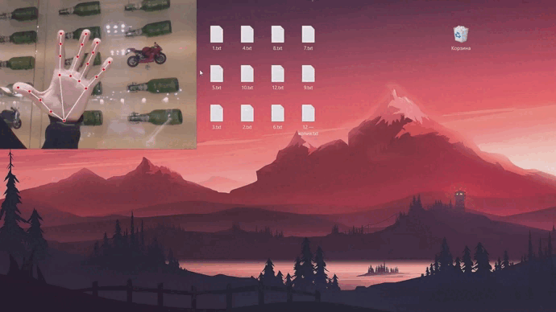
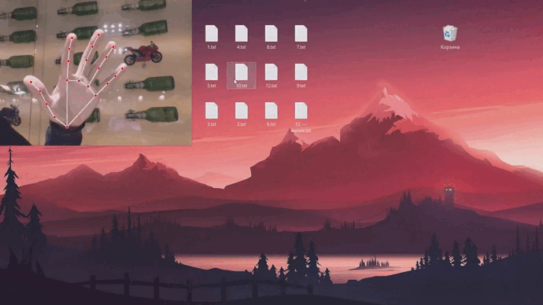
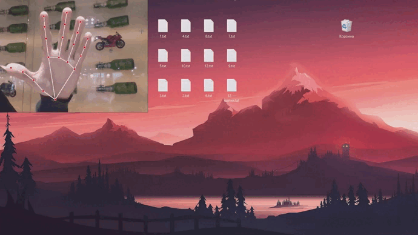
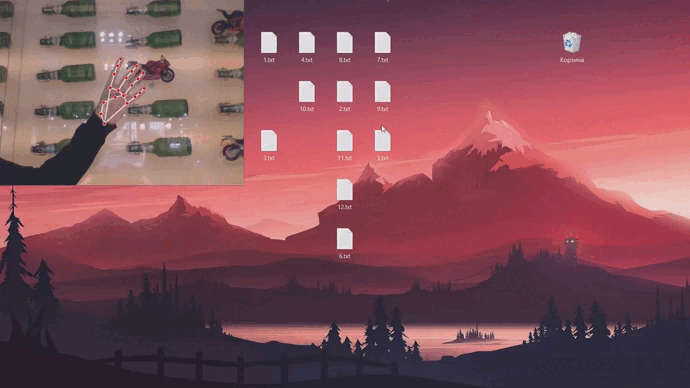

# Gesture-controlled pointer | OpenCV, Mediapipe

Introducing my pet project! This program enables real-time webcam-based hand gesture recognition. It smoothly controls cursor movement via finger tracking and ingeniously simulates mouse clicks using finger touches. The project brilliantly demonstrates human-computer interaction possibilities.

### Installation
1. Ensure that you have Python version 3.x installed.
2. Clone the project repository with the command _git clone https://github.com/Boohdaaaan/Gesture-controlled-pointer-opencv.git_.
3. Install the dependencies listed in the file: _pip install requirements.txt_
4. Run the main file: _python main.py_.  

Note that before running, make sure you are in the same directory as the requirements.txt and main.py files.

### How to Interact with the Project

The program allows you to interact with the cursor and perform mouse clicks using specific hand gestures.  After launching the main file, the video from your webcam will appear on your screen.  

1. **Pointer Movement:** Move your index finger to control the cursor's movement on the screen.  
   
   
     
   
2. **Left Mouse Click:** Touch your thumb and pinky finger together to simulate a left mouse button click. 
    
   
   

3. **Right Mouse Click:** Touch your thumb and ring finger together to simulate a right mouse button click.  
   
   

4. **Hold left or right mouse button:** Touch your thumb and small finger together and don't let go.  
   
   
     

# Керування мишею за допомогою жестів| OpenCV, Mediapipe

Представляю мій пет-проєкт! Програма дозволяє розпізнавати жести рукою в реальному часі за допомогою веб-камери. Плавно контролює рух курсору за допомогою відстеження пальців і імітує кліки миші за допомогою дотиків пальців. Проєкт гарно демонструє можливості взаємодії людини з комп'ютером.

### Installation
1. Переконайтесь, що у вас встановлено Python 3.x.
2. Склонуйте репозиторій проєкту за допомогою команди: _git clone https://github.com/Boohdaaaan/Gesture-controlled-pointer-opencv.git_.
3. Встановіть залежності, перелічені у файлі: _pip install requirements.txt_
4. Запустіть головний файл: _python main.py_.  

Перед запуском переконайтеся, що ви перебуваєте в тому самому каталозі, що й файли requirements.txt і main.py.

### Взаємодія з проєктом

Програма дозволяє взаємодіяти з мишею за допомогою певних жестів.  
Після запуску основного файлу на екрані з'явиться відео з веб-камери.

1. **Рух курсору:** Рухайте вказівним пальцем, щоб керувати рухом курсору на екрані. 
   
   
     
   
2. **Клік лівою кнопкою миші:** Доторкніться великим пальцем до мізинця, щоб імітувати натискання лівої кнопки миші. 
    
   
   

3. **Клік правою кнопкою миші:** Доторкніться великим пальцем до підмізинного, щоб імітувати натискання правої кнопки миші.  
   
   

4. **Утримування лівої або правої кнопки миші:** Доторкніться великим пальцем до мізинця і не відпускайте їх.
   
   
    